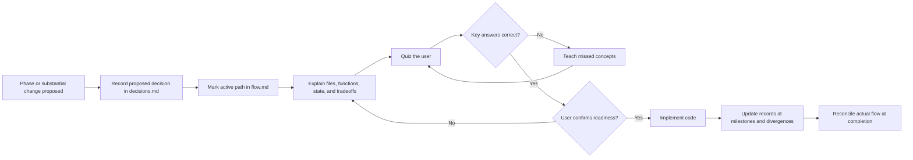
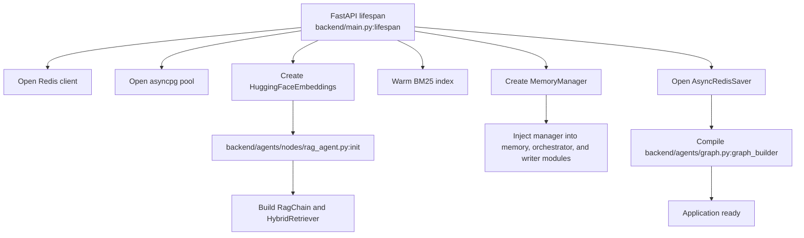
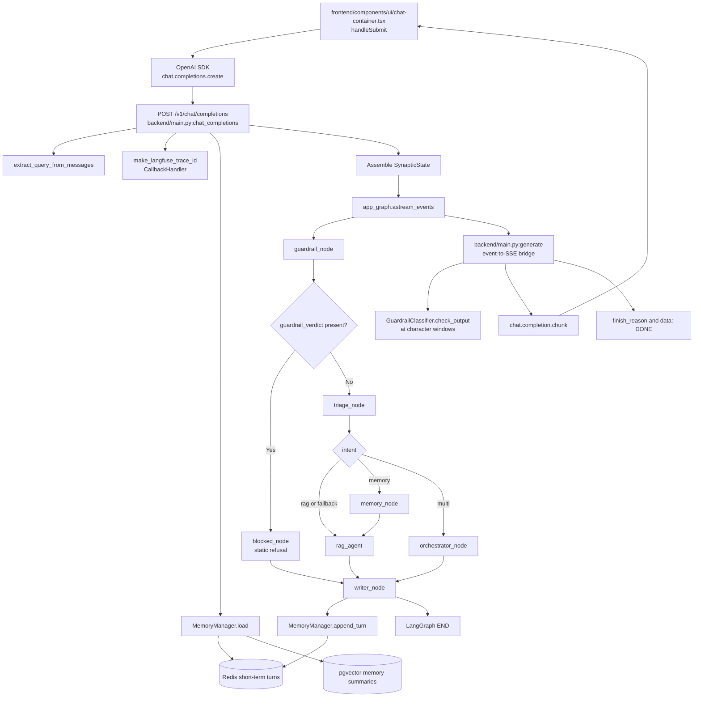
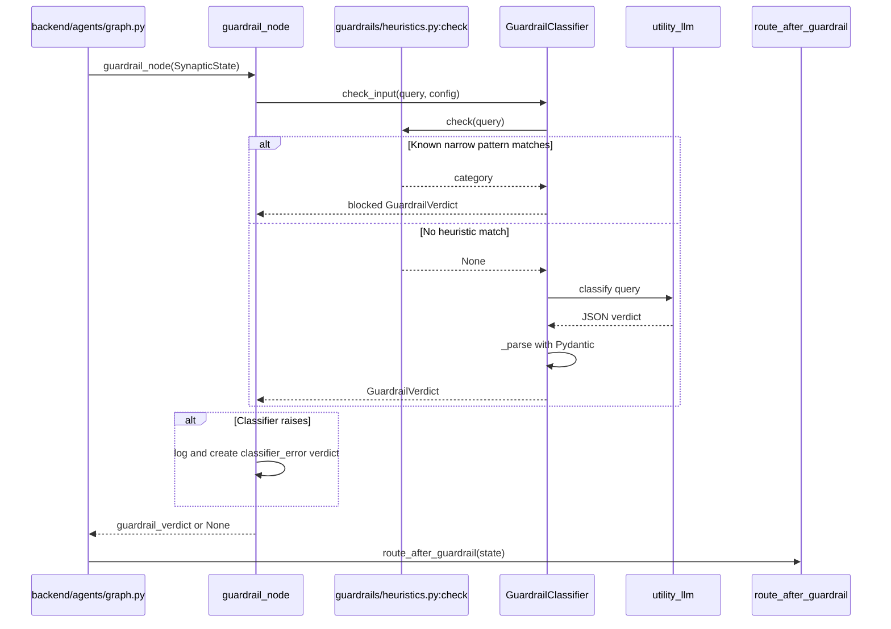
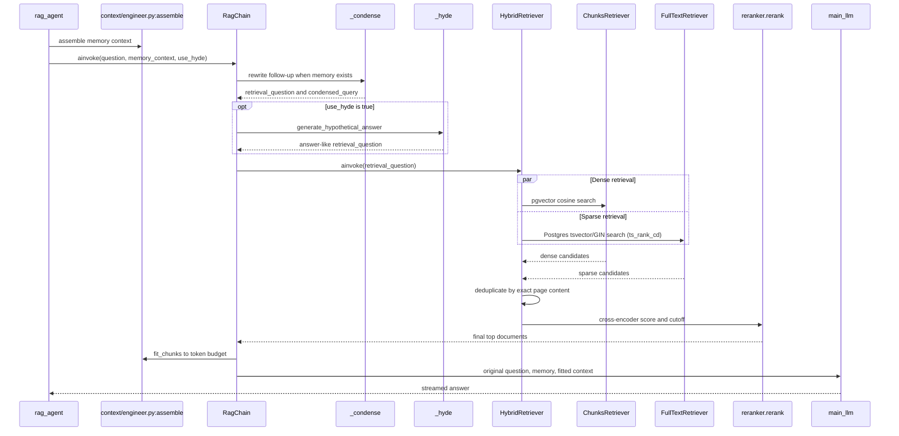
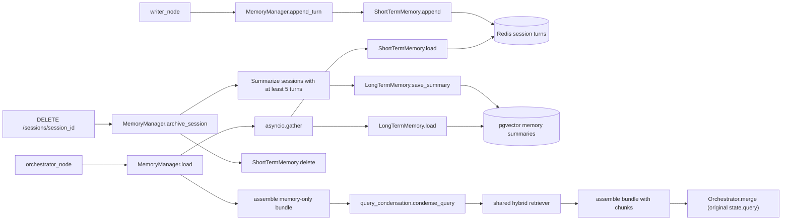
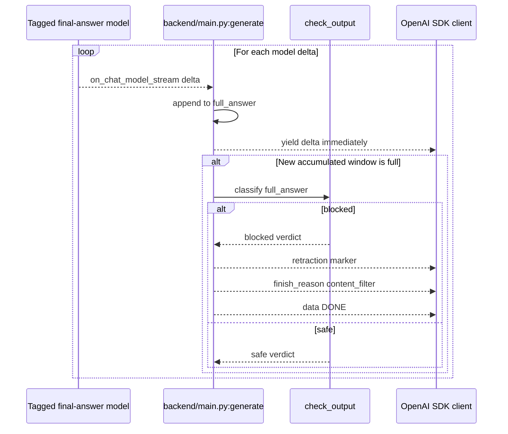
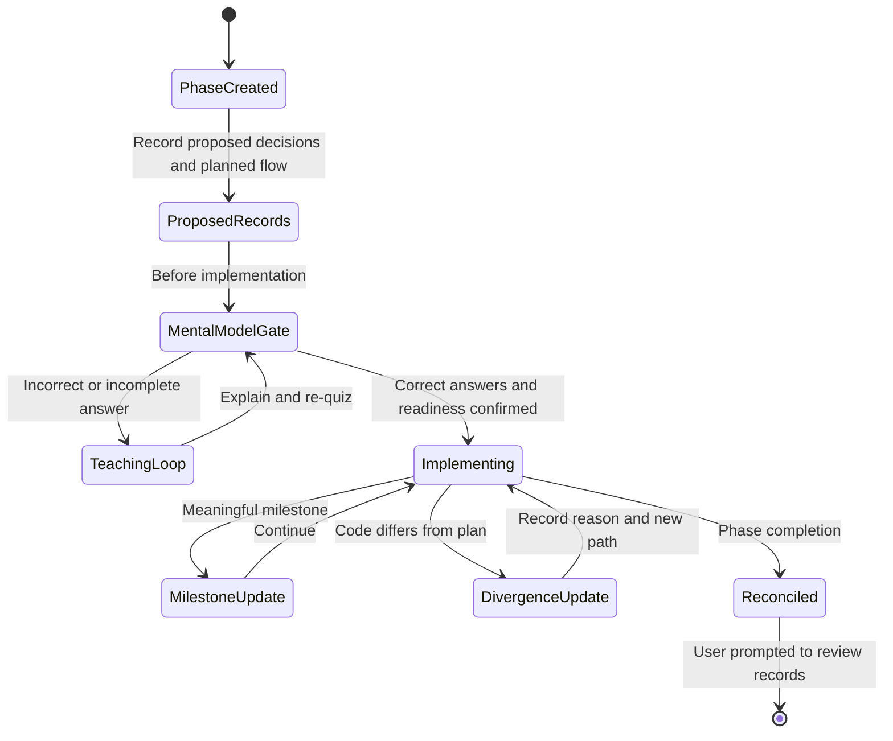

# Synaptic Execution Flow

This file is the living, code-level map of how execution moves through Synaptic.
It records files, functions, state changes, branch order, and the exact path affected by active work.
It describes implemented behavior rather than intended roadmap behavior.

## Verification Boundary

- Last verified: 2026-08-12
- Backfill branch: `feat/guardrails`
- Branch at final verification: `feat/replace-bm25-with-postgres-tsvector`
- Commit: `ea21d35`
- Runtime basis: Commit `ea21d35` plus clearly labeled uncommitted behavior
- Primary sources: Present code, reachable commits, and implemented phase evidence

Only implemented phases and implemented slices of partial phases appear below.
Historical phase prose does not override present code.

## Active Change

- Change: D-019 (Proposed) — calibrating `RERANK_SCORE_CUTOFF` via a sweep run with `evals/ragas_runner.py --metrics context`. 2 of 5 planned cutoff values run as of this entry (0.0, 1.5); 3.0, 4.5, 6.0 remain.
- Constraint while this is open: do not edit any file in `RagChain`'s import graph (`chain/rag_chain.py`, `retrieval/*.py`, `constants.py`, `context/engineer.py`, `llm.py`, `ingestion/stackoverflow_loader.py`) until the sweep finishes — `ragas_runner.py` re-imports fresh per run, so an edit between sweep points would make them incomparable. Files outside that graph (`agents/nodes/guardrail_node.py`, `guardrails/*.py`, `main.py`, frontend) are unaffected and safe to edit concurrently.
- Last completed change: Reconciled Phase 3.5 (D-018) on 2026-08-19 — committed the in-progress `feat/replace-bm25-with-postgres-tsvector` migration (`BM25Retriever` → `FullTextRetriever` on Postgres `tsvector`/GIN, shared `tokenize()` module) and the `writer_node.py` append-turn timeout wrapper. Verified against the live DB before committing: `chunks.content_pretokenized`/`content_tsv` populated for all 132,974 rows, migration already applied and running, not merely written.
- Previously completed change: Tightened `BEHAVIORAL_GUARDRAILS` (D-017) on 2026-08-18; later found empirically insufficient (see D-017 addendum in `decisions.md`, dated 2026-08-19) — kept in the prompt but superseded in direction by D-019.
- Previously completed change: Fixed `orchestrator_node` retrieving on the raw, unresolved follow-up query (D-016) on 2026-08-18. Extracted `RagChain`'s condensation chain into shared `retrieval/query_condensation.py::condense_query`; `orchestrator_node` now loads memory, condenses the query against it, then retrieves, instead of running memory load and retrieval concurrently on the raw query. Comprehension gate ran before that code was edited.
- Status: Code and `decisions.md` reconciled through D-018. D-019 open (Proposed) pending the remaining 3 sweep points.
- Gate status: D-016/D-017/D-018 satisfied. D-019 is evaluation work, not a code/architecture change, and was not gated — no runtime behavior changes until a final cutoff is chosen and D-019's status moves to Accepted.
- Files changed (D-018): `backend/retrieval/fulltext_retriever.py` (new), `backend/retrieval/tokenize.py` (new), `backend/retrieval/bm25_retriever.py` (removed), `backend/retrieval/hybrid.py`, `backend/retrieval/chunks_retriever.py`, `backend/retrieval/reranker.py`, `backend/db/schema.sql`, `backend/ingestion/stackoverflow_loader.py`, `backend/scripts/backfill_pretokenized.py` (new), `backend/agents/nodes/writer_node.py`, `backend/main.py`, `backend/requirements.txt`, `decisions.md`, `flow.md`.
- Files changed (D-019, so far): `backend/evals/ragas_runner.py` (`--metrics`, `--workers`, `--pipeline-concurrency` flags added; pipeline stage parallelized; report now records `rerank_score_cutoff`/`metrics`), `decisions.md`.
- Follow-up not in scope: Corpus has no document answering Java array/List/Collections reversal (verified by direct query against 132,981 ingested documents). Filling this gap is a Phase 3.1 ingestion decision, not part of D-016/D-017/D-019.

## Implemented Phase Ledger

| Phase | Verified implementation | Evidence boundary |
| --- | --- | --- |
| Phase 1 - Foundation | FastAPI, PostgreSQL with pgvector, ingestion, RAG, basic frontend, and chat streaming exist. | Commits from `e8416f6`, current `backend/main.py`, `backend/chain/rag_chain.py`, and `frontend/`. |
| Phase 1.2 - Retrieval Quality | Dense score filtering, over-fetch, cross-encoder reranking, reranker cutoff, and empty-context handling exist. | Commits from `11594d0`, current retrievers, and `RagChain._answer`. |
| Phase 2 - Multi-Agent and Memory | `SynapticState`, LangGraph routing, triage, RAG, memory, orchestrator, writer, Redis short-term memory, pgvector long-term memory, and checkpointing exist. | Branch `feat/memory-enginerring`, commits through `4f25ef4`, and current agent and memory modules. |
| Phase 3 - Context RAG | Context budgets, context assembly, compression path, query condensation, optional HyDE, and hybrid retrieval exist. | Branch `feat/context-engineering`, commits `e0470af`, `95c18f9`, `9d86b3f`, `72688b7`, and current context and retrieval modules. |
| Phase 3.1 - Answer-Grounded Dataset | Kaggle and StackExchange adapters, shared document building, document/chunk schema, holdout handling, and reference RAGAS code exist. | Branch `feat/update-dataset-and-ingestion`, commits through `7347a70`, and current ingestion and schema modules. |
| Phase 3.5 - Postgres Full-Text Search | In-memory BM25 replaced with a generated `tsvector`/GIN column on `chunks`, scored via `ts_rank_cd`; shared `tokenize()` used at ingestion and query time; live DB migration and backfill verified complete. | Branch `feat/replace-bm25-with-postgres-tsvector`, `backend/retrieval/fulltext_retriever.py`, `backend/retrieval/tokenize.py`, `backend/db/schema.sql`, decision D-018. |
| Phase 4 - Guardrails | Input heuristics, LLM classification, fail-closed routing, static refusals, windowed output checks, and a guardrail eval runner exist on the current branch. | Branch `feat/guardrails`, commits `76183d2`, `144dc24`, and `ea21d35`. |
| Phase 5 - Implemented slices only | Langfuse traces, observed nodes, basic metrics, RAGAS reference evaluation code, and the basic chat UI exist. | Commits `60ac653` and `3646615`, current tracing, eval, metrics, and frontend code. The phase as a whole is not marked complete. |

## Startup Flow

FastAPI owns resource creation and injects shared dependencies before accepting requests.

The current worktree also calls `backend/retrieval/reranker.py:preload` during startup.
That preload and the writer timeout are uncommitted behavior and are not recorded as accepted historical decisions.

## End-to-End Chat Request

## Ordered Request Calls

### 1. Frontend submission

1. `frontend/components/ui/chat-container.tsx:handleSubmit` creates a user message and an empty assistant message.
2. It keeps one browser-lifetime `session_id` in a React ref created with `crypto.randomUUID()`.
3. It calls the OpenAI client through `client.chat.completions.create` with `stream: true` and the current `session_id`.
4. It iterates SDK chunks and appends `choices[0].delta.content` to the assistant message.

### 2. FastAPI request setup

1. `backend/main.py:chat_completions` receives `ChatCompletionRequest` at `POST /v1/chat/completions`.
2. `extract_query_from_messages` walks backward to find the last user message and raises an HTTP error if none exists.
3. `make_langfuse_trace_id` normalizes a UUID-like session ID or derives a deterministic UUID5 trace ID.
4. `MemoryManager.load` concurrently loads short-term turns and relevant long-term summaries before graph execution.
5. `chat_completions` builds `SynapticState` with the query, memories, system prompt, empty result fields, trace metadata, and the `use_hyde` flag.
6. It passes the session ID to LangGraph as `thread_id` so `AsyncRedisSaver` can checkpoint graph state.
7. It returns a `StreamingResponse` backed by the nested `generate` async generator.

### 3. Graph entry and input guardrail

1. `backend/agents/graph.py` starts every request at `guardrail_node`.
2. `GuardrailClassifier.check_input` runs `guardrails.heuristics.check` first.
3. A heuristic match returns a blocked verdict without an LLM call.
4. A miss calls `utility_llm`, strips optional JSON fences, and validates `GuardrailVerdict` with Pydantic.
5. Any exception in `guardrail_node` becomes a fail-closed `classifier_error` verdict.
6. The node stores only blocked verdicts in `SynapticState.guardrail_verdict`; a safe verdict becomes `None`.
7. `route_after_guardrail` sends blocked state to `blocked_node` and safe state to `triage_node`.
8. `blocked_node` selects a static refusal by category and writes `final_answer` without calling an LLM.

### 4. Triage and graph branches

`backend/agents/nodes/triage.py:triage_node` calls `Triage.run` with the query and short-term memory.
`Triage.run` asks `utility_llm` for a Pydantic-validated intent and metadata filters.

| Triage result | Exact graph path | Main work |
| --- | --- | --- |
| `rag` | `triage_node` -> `rag_agent` -> `writer_node` -> `END` | Assemble memory context, retrieve evidence, answer, and derive citations. |
| `memory` | `triage_node` -> `memory_node` -> `rag_agent` -> `writer_node` -> `END` | Reload memory into state, then execute the normal RAG path. |
| `multi` | `triage_node` -> `orchestrator_node` -> `writer_node` -> `END` | Load memory, condense the query against it, retrieve documents with the condensed query, then merge memory and retrieval with the main LLM. |
| Any other value, including `blocked` | `triage_node` -> `rag_agent` -> `writer_node` -> `END` | `route_query` defaults every value other than `memory` and `multi` to `rag_agent`. Input blocking is therefore owned by the preceding guardrail branch. |

### 5. RAG path

1. `rag_agent` calls `context.engineer.assemble` for short-term and long-term memory.
2. `RagChain._condense` calls the shared `retrieval/query_condensation.py::condense_query`, which keeps the original question when no memory exists.
3. When memory exists, `condense_query` sends only lines beginning with `Human:` to the condensation chain and produces a standalone retrieval question. `orchestrator_node` calls the same function before its own retrieval (see section 6).
4. `RagChain._hyde` optionally replaces only the retrieval question with `generate_hypothetical_answer` output.
5. `HybridRetriever._aget_relevant_documents` runs dense and sparse retrieval concurrently with `asyncio.gather`.
6. `ChunksRetriever` embeds the query, applies the pgvector cosine-distance cutoff, and over-fetches candidates.
7. `FullTextRetriever` tokenizes the query with the shared `retrieval/tokenize.py::tokenize()` (the same tokenizer used at ingestion to populate `content_pretokenized`), queries `chunks.content_tsv` (a generated, GIN-indexed `tsvector` column) via `websearch_to_tsquery` and `ts_rank_cd`, applies `FULLTEXT_MIN_SCORE`, and returns its top `FULLTEXT_TOP_K` candidates. No in-memory corpus — every query hits the GIN index directly (replaces the `BM25Retriever` this path used before D-018).
8. `merge_candidates` deduplicates the combined candidates by exact `page_content`.
9. `reranker.rerank` cross-encodes the union, applies `RERANK_SCORE_CUTOFF`, and keeps `RETRIEVAL_TOP_K` documents.
10. `RagChain._answer` returns a static no-context reply when retrieval is empty.
11. Otherwise, `fit_chunks` enforces the retrieved-chunk token budget and the tagged main LLM chain generates the answer from the original question, memory, and fitted context.
12. `rag_agent` writes `final_answer`, `retrieved_chunks`, citations, condensed query, token counts, decisions, and budget state to `SynapticState`.

The current hybrid implementation is a deduplicated union followed by a cross-encoder rerank.
It is not reciprocal-rank fusion even if older planning text or commit wording uses the term RRF.

### 6. Memory and orchestration paths

- `MemoryManager.load` concurrently calls `ShortTermMemory.load` and `LongTermMemory.load`.
- Short-term memory uses `session:{session_id}:turns`, refreshes its TTL on append, caps stored turns, and truncates loaded context to its token budget.
- Long-term memory embeds the current query, searches stored summaries by cosine similarity, and applies relevance and recency scoring.
- `memory_node` reloads both memory sources and returns them into state before `rag_agent` runs.
- `orchestrator_node` calls `MemoryManager.load` first, assembles a memory-only bundle, and calls `query_condensation.condense_query` to resolve referential follow-ups (e.g. "how to do the same in react") against prior human turns before retrieval runs. This is sequential, not concurrent — retrieval depends on the condensed query. Retrieval still uses the shared hybrid retriever, and a second `assemble` call adds the retrieved chunks to the bundle. `Orchestrator.merge` receives the original `state["query"]`, not the condensed one, so the answer responds to what the user actually asked. `query_condensation.condense_query` is shared with `RagChain._condense` (see section 5) rather than duplicated.
- `writer_node` persists every non-empty final answer, including static blocked refusals, through `MemoryManager.append_turn`.
- The current uncommitted worktree wraps that append in a ten-second timeout and re-raises a timeout after logging it.
- `MemoryManager.archive_session` summarizes and clears only sessions with at least five turns.
- The LangGraph `AsyncRedisSaver` checkpoint is separate from conversation-turn storage even though both use Redis and the same session ID.

### 7. Writer and SSE bridge

`writer_node` is the final graph node for every branch.
It appends the user query and non-empty `final_answer` to short-term memory, then returns no state fields and reaches `END`.

`backend/main.py:generate` translates graph events into the OpenAI-compatible stream:

1. It emits an assistant role chunk before content.
2. It listens for `on_chat_model_stream` events tagged `final_answer`.
3. It appends each delta to `full_answer` and yields the delta immediately.
4. After each full `OUTPUT_CHECK_WINDOW_CHARS` increment, it calls `GuardrailClassifier.check_output` with all accumulated text.
5. A blocked verdict emits a retraction marker, a `content_filter` finish chunk, and `[DONE]`, then returns.
6. A static `blocked_node` response has no model stream, so `generate` detects that node's `on_chain_end` event and emits its `final_answer` as one chunk.
7. Normal completion updates in-memory metrics, emits `finish_reason="stop"`, and emits `[DONE]`.
8. An upstream connection error emits a dedicated service message; any other exception emits the generic failure message; both terminate normally at the protocol level.

Current output-guardrail limits are part of the actual flow:

- Already yielded text cannot be removed from the client.
- An answer shorter than one configured window is not output-classified.
- The final partial window after the last full check is not output-classified.
- The SSE bridge explicitly emits tagged model streams and static `blocked_node` output.
- Other static final answers or untagged model paths are not explicitly bridged by the current generator.

## Phase Update Lifecycle

### When a phase is created

- Add `Proposed` entries to `decisions.md` for meaningful choices.
- Replace the `Active Change` block with the planned file and function path.
- Show planned branches in Mermaid and label them as planned, not implemented.
- Proactively tell the user that the records were updated and that the quiz gate will run before code changes.

### Before phase implementation

- Re-read `decisions.md`, `flow.md`, the phase record, current branches, and relevant commits.
- Explain the proposed mental model at file, function, state, and dependency levels.
- Quiz the user with three to five questions covering execution order, ownership boundaries, failure behavior, and tradeoffs.
- Explain missed answers and re-quiz them until the key answers are correct.
- Ask the user to confirm readiness.
- Do not modify implementation code before both conditions are met.

### During implementation

- Update the active path at each meaningful milestone.
- Add or revise a decision when a meaningful choice is made or rejected.
- Record divergence before continuing with a path that differs from the accepted plan.
- Keep Mermaid diagrams synchronized with actual graph edges and call order.

### At phase completion

- Trace the code again instead of copying the planned path.
- Replace planned flow with actual flow.
- Mark decisions `Accepted`, `Rejected`, or `Superseded` with evidence.
- Update the implemented phase ledger only for capabilities present in code.
- Prompt the user to review both living records before declaring the phase complete.

## Flow Update Checklist

- [ ] The active change names the exact runtime or process segment being modified.
- [ ] Every changed module appears in the active path or is explicitly out of scope.
- [ ] Function names and graph edges match current code.
- [ ] State fields identify their writer and next reader.
- [ ] Concurrent work is shown as concurrent rather than sequential.
- [ ] Static outputs and streamed outputs are distinguished.
- [ ] Failure and blocked paths reach their actual terminal nodes.
- [ ] Mermaid diagrams describe implemented behavior and render with valid syntax.
- [ ] Planned phases are not presented as implemented.
- [ ] `decisions.md` records the reasons and accepted tradeoffs behind meaningful path changes.
